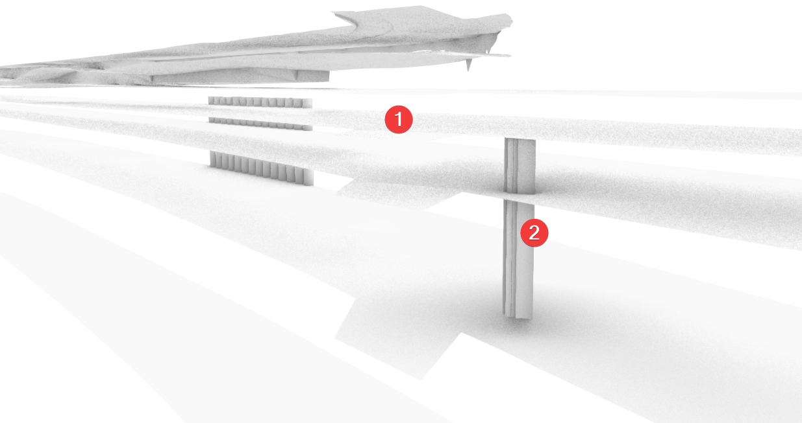
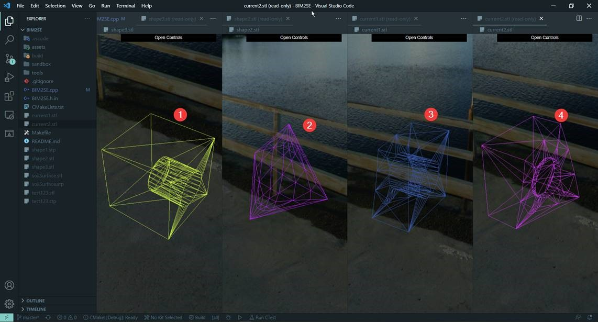
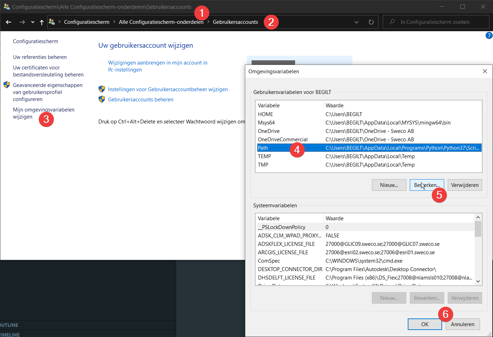

# POC - BIM2SE

> BIM to System Engineering

Aim for this Proof Of Concept is to examine if soil volumes can be calculated on an automatic fashion. Currently the workflow works with soil surfaces, but it could also work with HalfSpaces. 

## INPUT

The input data exists of the following files:

```bash
assets/obj/BIM model.json   # Object properties definition
assets/obj/BIM model.obj    # Object geometry definition
assets/obj/hybride grondmodel.db    # Soil model properties definition
assets/obj/hybride grondmodel.json  # Soil model properties definition
assets/obj/hybride grondmodel.obj   # Soil model geometry definition 
```



The files are exported from BIM360 using the ***Autodesk Forge API**.

### Coordinate system 

The coordinate system is different for the models. To move them to the location according EPSG:31370, the following translation is necesarry for the `BIM model.obj`:

- **X-translation** = 153700 (m)
- **Y-translation** = 214700 (m)

## PROCESSING

Geometry is first converted from `.obj` files to `.stl` files. In this process, data is lost. We still need to examine what kind of data is lost. 

Currently, we rely on **FME** to do the data transformation. A script could be running on the **FME** server to do this transformation on the fly. I have the following process in mind.

DANGER: During translation with **FME**, the geometry moved?! 

During processing we're creating these files:
```bash
assets/obj/BIM model.stl    # Object geometry definition
assets/obj/hybride grondmodel.stl   # Soil model geometry definition 
```

> File is updated on BIM360 → *Webhook* send to **FME Server**, tranformation of the model to an `.obj` file is started and a *Webhook* is registered that is called when this transformation is done. This *Webhook* calls another script that is running on the **FME Server**. The script downloads the `.obj` file and converts it to an `.stl` file. Next, a script is called to make the intersection between the file and the soilsurfaces. Volumes are calculated and reattached to the original BIM model.

Another approach would be to write everything in Python. Currently everything is written in `.CPP`, but the ecosystem of Python is much friendlier and we could use more packages to simplify the general inner working. 

### Issues

We stumbled upon the following issues:
- Open Cascade is made to work with *BRep* data - you can read more about the difference with *meshes* [here](https://www.shapediver.com/blog/shapediver-basics-meshes-vs-b-reps-explained)
- By converting the *meshes* back to *BRep's*, the process is extremely slow. It takes a very long time to convert the data.

## OUTPUT

The output are both `.stl` files as `.stp` *STEP* files. The first one is a very simple geometry. It's represented by a meshed geometry and is not that accurate, but this is not an issue regarding the soil volume calculations.

Next to the *geometry* files are we also outputting a data format containing the soil volumes for each object. This information should be translated back to the BIM models.

### Current progress

Soil intersection is possible using a script, can script can run headless, the process can be activated using webhooks for example. 



# Installation

Open Cascade Technology (OCCT) Sandbox. Place to play around with the API.

## Configure, Build and Run

To generate a build, I'm relying on a build system, **make**. However, the build system is created by **cmake**, a tool to generate a build system, platform independent. What it does, after some initial configuration, is building a *build* folder containing all necessary files and a preconfigured *Makefile* where all links and libraries locations are added to generate a binary using **make**.

In the main directory, simply run `make` to execute a couple of shell scripts that:
1. run `cmake` and make the *build* directory
2. run `make` inside the *build* directory
3. run the *binary* that has been created

You can have a look inside the *tools* directory what the shell scripts are doing.

As you probably noticed, `make` is used twice in this workflow. By running `make` inside the main directory, the *configure, build and run* procedure is started which consists of the 3 earlier discussed steps. In the second step, `make` is used to start the build in the *build* directory.

## Project structure

While I'm not following the *best practices* at the moment, this might change in the futur. I'll follow [this guideline](https://api.csswg.org/bikeshed/?force=1&url=https://raw.githubusercontent.com/vector-of-bool/pitchfork/develop/data/spec.bs#intro) whenever this project start to become bigger. 

## Installing Open Cascade

One of the dependencies is **Open Cascade** ofcourse. The installation procedure depends on the operating system you're running. Currently, I'm only including the installation process for linux and mac. 

We need to **distinguish OCE and OCCT**, both related to Open Cascade Technology, but the first one is the Community Edition. It includes a couple of patches. However, the ease of installation depends on the operating system. OCE is very easy to install on Ubuntu, while OCCT is the easiest on MacOS.  

### Dependencies

To build the code, you'll need a **compiler** like `gpp`, `make` and `cmake`.

To install `cmake`, please see the [official documentation](https://cmake.org/install/).

### Ubuntu

Normally, `make` should come out of the box (I guess so...). To install `cmake`, you could also use snap (`snap install cmake`) to install the tool on Ubuntu. 

Run the following:
```bash
sudo apt update -qq
sudo apt install -y liboce-*
```

### MacOS

Install XCode (see the Apple [Developer website](https://developer.apple.com/xcode/)) and the command line utilities (`sudo xcode-select --install`). Make sure to have `cmake` installed as well. 

Then, install *Homebrew* (see [official documentation](https://brew.sh/)), and run the following:

```bash
brew install opencascade
```

### Windows

#### Installation of the **Compiler**   

First, you need to isntall a C++ compiler. Follow the installation guide of [MSYS2](https://www.msys2.org/). 
After the installation, add the directory to your path.

Add the following paths to `%PATH%`

```bash
C:\Users\<user>\AppData\Local\MSYS2\usr\bin\
C:\Users\<user>\AppData\Local\MSYS2\mingw64\bin\
```
In my case, I choose to install MSYS2 inside my user folder.



To test if it's working, check if `make` and `gcc` are available using `where <command>`.

#### Installation of `cmake`

After installing the compiler, we'll install `cmake`. Download the `.zip` from their website and locate the extracted files inside the following path:

```bash
C:\Users\<user>\AppData\Local\CMake\
```
Add the following path to your `%PATH%`, see the method above:

```bash
C:\Users\<user>\AppData\Local\CMake\bin
```
Check if it's working: `where cmake`

#### Installation of **OCCT**

##### Approach 1 : FAILED

> This method has not completely failed. During the compilation of the script `hello.cpp`, I've got a warning about a package `libTKXSDRAW.dll.a` that was not found. I don't know why, but the file hasn't been compiled during the process. Possibly, it has to do with some options I set. However, I advise you to use method 2 since it doesn't require you to compile all code.

Download the `.tgz` from the [official docs](https://dev.opencascade.org/release) and uncompress the file. 

Move the files to:

```bash
C:\Users\BEGILT\AppData\Local\OCCT
```
Now, we need to compile the source data. However, Open Cascade depends on some other packages. 
You can download a precompiled package from [their website](https://dev.opencascade.org/resources/download/3rd-party-components). **Freetype** is required. Download the `.7z` for **MinGW** and move the files to:

```bash
# Add Freetype
C:\Users\<user>\AppData\Local\Freetype
```
You could also build the files from source, see the [guidelines](https://dev.opencascade.org/doc/overview/html/build_upgrade_building_3rdparty.html) on the website of Open Cascade.

Follow the same procedure for **Tcl**, because it's also required! Store it in the following folder:

```bash
# Add Freetype
C:\Users\<user>\AppData\Local\Tcl
```

The next step is to generate the build script for OCCT and compile the package (that might take a while!):

```bash
cmake -G"MSYS Makefiles" -D USE_VTK=OFF -D USE_FREEIMAGE=OFF -D USE_D3D=OFF -D 3RDPARTY_FREETYPE_DIR="C:/Users/BEGILT/AppData/Local/Freetype" -D 3RDPARTY_TCL_DIR="C:/Users/BEGILT/AppData/Local/Tcl" -S . -B C:/OCCT
```

After generating the build script, navigate to the build directory and build using make:

```bash
cd C:/OCCT && make
```

After finishing the build process, navigate to `C:/OCCT` and run the following. 
It's a tempory fix for a bug I was encountering.

```bash
#!/bin/bash
mkdir -p "cmake"
mv ./OpenCASCADE*.cmake ./cmake
mv ./CMakeFiles/Export/cmake/OpenCASCADE*.cmake ./cmake
sed -i 's:\\${OCCT_INSTALL_BIN_LETTER}::g' ./cmake/OpenCASCADE*-release.cmake
```

During the compilation of the script `hello.cpp`, I've got a warning about a package `libTKXSDRAW.dll.a` that was not found. I don't know why, but the file hasn't been compiled during the process. Possibly, it has to do with some options I set.

##### Approach 2 : PASSED

Open the *MSYS2 MinGW 64-bit* terminal. Run the following:

```bash
pacman -Syu
# Install OpenCASCADE
pacman -S mingw-w64-x86_64-opencascade
```

After installation, fix the bug like in approach 1.

```bash
sed -i 's:\\${OCCT_INSTALL_BIN_LETTER}::g' C:/Users/<username>/AppData/Local/MSYS2/mingw64/lib/cmake/opencascade/OpenCASCADE*-release.cmake
```

#### Update `CMakeLists.txt`

Add the path to your `CMakeLists.txt` in order to find the OCCT installation during build. In case of approach 1, this is `C:/OCCT` and in case of approach 2 it's `C:/Users/<username>/AppData/Local/MSYS2/mingw64/`.

## Inspiration

I stumbled upon the *FindOpenCasCade.cmake* file by [FreeCAD](https://github.com/FreeCAD/FreeCAD/blob/5d49bf78de785a536f941f1a6d06d432582a95d3/cMake/FindOpenCasCade.cmake). This file contains a lot of intersting code I could use in this project. While FreeCAD depends on OCE, I adapted the script to search for OCCT on MacOS.

## ToDo's

- [x] Install instructions *Unix*
- [x] Install instructions *MacOS*
- [x] Install instructions *Windows*
- [ ] Powershell/Bash script to simplify the installation
- [ ] Simplify the `CMakeLists.txt` to accomodate the different platforms